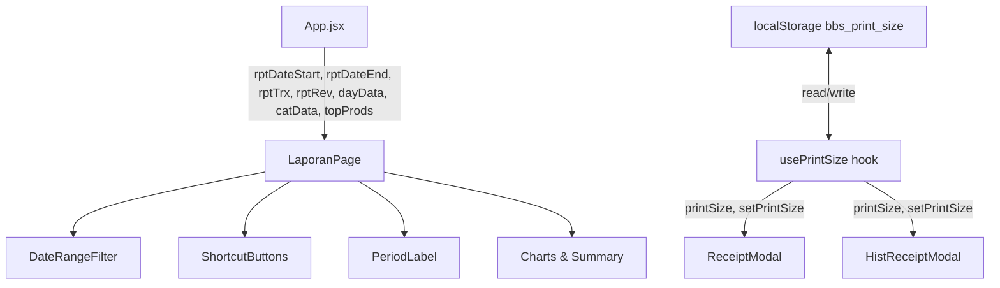

# Design Document

## Fitur: Laporan Range Tanggal Custom & Thermal Printing
**Aplikasi:** POS BerkahBirdShop (Toko_BBS)
**Stack:** React 19 + Vite + Supabase + Tailwind CSS

---

## Overview

Dokumen ini mendeskripsikan desain teknis untuk dua peningkatan fitur pada Toko_BBS:

1. **Laporan Range Tanggal Custom** — Mengganti filter bulan+tahun di `LaporanPage` dengan input rentang tanggal bebas (start–end), dilengkapi shortcut "Hari Ini", "7 Hari", "Bulan Ini", validasi, dan export yang menggunakan rentang aktif.

2. **Thermal Printing** — Mengoptimalkan CSS `@media print` untuk printer thermal 58mm/80mm, menambahkan tombol "Cetak Langsung" yang bypass preview browser, mempersist `PrintSize` ke `localStorage`, dan auto-close `ReceiptModal` 2 detik setelah cetak langsung.

Kedua fitur ini bersifat frontend-only dan tidak memerlukan perubahan skema database Supabase.

---

## Architecture

### Alur Data Laporan (Sebelum vs Sesudah)

**Sebelum:**
```
App.jsx
  rptMonth (state) ──┐
  rptYear  (state) ──┴──► LaporanPage (filter per bulan)
```

**Sesudah:**
```
App.jsx
  rptDateStart (state) ──┐
  rptDateEnd   (state) ──┴──► LaporanPage (filter per rentang tanggal)
  
  Kalkulasi di App.jsx:
    rptTrx   = transactions.filter(t => t.date >= start && t.date <= end && t.status !== 'void')
    rptRev   = sum(rptTrx.total)
    dayData  = array per hari dalam rentang
    catData  = agregasi per kategori
    topProds = top 5 produk
```

### Alur PrintSize (Sebelum vs Sesudah)

**Sebelum:**
```
ReceiptModal     → useState('80')  [tidak persist]
HistReceiptModal → useState('80')  [tidak persist]
```

**Sesudah:**
```
localStorage['bbs_print_size']
       ↑ write          ↓ read
ReceiptModal     → usePrintSize() hook
HistReceiptModal → usePrintSize() hook
```

### Diagram Komponen



---

## Components and Interfaces

### 1. `usePrintSize` — Custom Hook Baru

**Lokasi:** `src/hooks/usePrintSize.js`

```js
// Membaca dan menyimpan PrintSize ke localStorage
// Mengembalikan [printSize, setPrintSize]
// Nilai valid: '58' | '80', default: '80'
function usePrintSize(): [string, (size: string) => void]
```

- Membaca `localStorage.getItem('bbs_print_size')` saat inisialisasi
- Validasi: hanya terima `'58'` atau `'80'`, selain itu fallback ke `'80'`
- Setiap kali `setPrintSize` dipanggil, tulis ke `localStorage`

### 2. `buildPrintStyle(printSize)` — Fungsi Utilitas Baru

**Lokasi:** `src/utils/constants.js` (tambahan export)

```js
// Menghasilkan string CSS @media print untuk ukuran thermal
// printSize: '58' | '80'
// Returns: string CSS
function buildPrintStyle(printSize: string): string
```

Contoh output untuk `'58'`:
```css
@media print {
  @page { size: 58mm auto; margin: 2mm; }
  body > *:not(#struk-print) { display: none !important; }
  #struk-print { display: block !important; width: 54mm !important; font-family: monospace; font-size: 10pt; }
}
```

### 3. `LaporanPage` — Perubahan Props Interface

**Sebelum:**
```jsx
<LaporanPage
  rptMonth={rptMonth} setRptMonth={setRptMonth}
  rptYear={rptYear}   setRptYear={setRptYear}
  rptTrx={rptTrx} rptRev={rptRev}
  dayData={dayData} catData={catData} topProds={topProds}
  kategoris={kategoris} products={products}
/>
```

**Sesudah:**
```jsx
<LaporanPage
  rptDateStart={rptDateStart} setRptDateStart={setRptDateStart}
  rptDateEnd={rptDateEnd}     setRptDateEnd={setRptDateEnd}
  rptTrx={rptTrx} rptRev={rptRev}
  dayData={dayData} catData={catData} topProds={topProds}
  kategoris={kategoris} products={products}
/>
```

Props `rptMonth`, `setRptMonth`, `rptYear`, `setRptYear` dihapus dari LaporanPage.

### 4. `ReceiptModal` — Perubahan

- Ganti `useState('80')` dengan `usePrintSize()`
- Tambah tombol "Cetak Langsung" (`handleDirectPrint`)
- `handleDirectPrint`: inject style → `window.print()` → hapus style setelah 1500ms → auto-close setelah 2000ms
- Deteksi `window.print` tidak tersedia → tampilkan pesan error, disable tombol

### 5. `HistReceiptModal` — Perubahan

- Ganti `useState('80')` dengan `usePrintSize()`
- Tambah tombol "Cetak Langsung" (`handleDirectPrint`)
- `handleDirectPrint`: inject style → `window.print()` → hapus style setelah 1500ms
- **Tidak** auto-close setelah cetak

---

## Data Models

### State Baru di `App.jsx`

```js
// Ganti rptMonth + rptYear dengan:
const [rptDateStart, setRptDateStart] = useState(() => {
  // Default: awal bulan berjalan
  const now = new Date();
  return `${now.getFullYear()}-${String(now.getMonth() + 1).padStart(2, '0')}-01`;
});
const [rptDateEnd, setRptDateEnd] = useState(() => {
  // Default: hari ini
  return new Date().toISOString().slice(0, 10);
});
```

### Kalkulasi `rptTrx` (Diperbarui di `App.jsx`)

```js
const rptTrx = useMemo(() => {
  const start = rptDateStart || null;
  const end   = rptDateEnd   || new Date().toISOString().slice(0, 10);
  return transactions.filter(t => {
    if (t.status === 'void') return false;
    if (start && t.date < start) return false;
    if (t.date > end) return false;
    return true;
  });
}, [transactions, rptDateStart, rptDateEnd]);
```

### Kalkulasi `dayData` (Diperbarui di `App.jsx`)

```js
// Menghasilkan array { dateStr: 'DD/MM', rev: number }
// untuk setiap hari dalam rentang rptDateStart–rptDateEnd
const dayData = useMemo(() => {
  if (!rptDateStart || !rptDateEnd) return [];
  const start = new Date(rptDateStart);
  const end   = new Date(rptDateEnd);
  const days  = [];
  for (let d = new Date(start); d <= end; d.setDate(d.getDate() + 1)) {
    const ds = d.toISOString().slice(0, 10);
    const rev = rptTrx
      .filter(t => t.date === ds)
      .reduce((s, t) => s + t.total, 0);
    const label = `${String(d.getDate()).padStart(2,'0')}/${String(d.getMonth()+1).padStart(2,'0')}`;
    days.push({ dateStr: label, rev });
  }
  return days;
}, [rptTrx, rptDateStart, rptDateEnd]);
```

### Format Label Periode

```js
// Contoh: "1 Jan 2025 – 15 Jan 2025"
function formatPeriodLabel(start, end) {
  const opts = { day: 'numeric', month: 'short', year: 'numeric' };
  const fmt  = (d) => new Date(d).toLocaleDateString('id-ID', opts);
  if (!start && !end) return 'Bulan Berjalan';
  if (!start) return `s.d. ${fmt(end)}`;
  if (!end)   return `${fmt(start)} – sekarang`;
  return `${fmt(start)} – ${fmt(end)}`;
}
```

### `localStorage` Key

| Key | Nilai Valid | Default | Digunakan Oleh |
|-----|-------------|---------|----------------|
| `bbs_print_size` | `'58'` \| `'80'` | `'80'` | `usePrintSize` hook |

---

## Correctness Properties

*A property is a characteristic or behavior that should hold true across all valid executions of a system — essentially, a formal statement about what the system should do. Properties serve as the bridge between human-readable specifications and machine-verifiable correctness guarantees.*

### Property 1: Filter Rentang Tanggal Inklusif

*For any* array transaksi dan pasangan tanggal (start, end) yang valid (start ≤ end), semua transaksi yang dikembalikan oleh fungsi filter harus memiliki `date >= start` dan `date <= end`, dan tidak ada transaksi yang memenuhi syarat tersebut yang boleh dikecualikan.

**Validates: Requirements 1.2, 1.3, 1.4**

### Property 2: Transaksi Void Selalu Dikecualikan

*For any* array transaksi yang mengandung campuran status `void` dan non-void, dan untuk semua rentang tanggal yang valid, tidak ada transaksi dengan `status === 'void'` yang boleh muncul dalam `rptTrx`.

**Validates: Requirements 2.4**

### Property 3: Konsistensi Kalkulasi Laporan

*For any* rentang tanggal dan array transaksi, nilai `rptRev` harus selalu sama dengan `sum(rptTrx.map(t => t.total))`, dan `dayData` harus mencakup tepat satu entri untuk setiap hari dalam rentang tanggal tersebut.

**Validates: Requirements 2.1**

### Property 4: Filter Kumulatif Tanggal + Kategori

*For any* array transaksi, rentang tanggal, dan kategori yang dipilih, hasil filter gabungan (tanggal AND kategori) harus merupakan subset dari hasil filter tanggal saja.

**Validates: Requirements 2.2**

### Property 5: Lebar Konten Thermal Sesuai PrintSize

*For any* nilai PrintSize yang valid (`'58'` atau `'80'`), string CSS yang dihasilkan oleh `buildPrintStyle` harus mengandung lebar `#struk-print` sebesar `(parseInt(PrintSize) - 4)mm`.

**Validates: Requirements 3.3, 3.5, 3.6**

### Property 6: Persistensi PrintSize Round-Trip

*For any* nilai PrintSize yang valid (`'58'` atau `'80'`), setelah disimpan ke `localStorage` melalui `setPrintSize`, membaca kembali nilai dari `localStorage['bbs_print_size']` harus menghasilkan nilai yang sama.

**Validates: Requirements 3.7, 3.8, 5.1, 5.2, 5.3**

### Property 7: Validasi PrintSize — Nilai Tidak Valid Diganti Default

*For any* string yang bukan `'58'` atau `'80'` yang tersimpan di `localStorage['bbs_print_size']`, `usePrintSize` harus mengembalikan `'80'` sebagai nilai awal.

**Validates: Requirements 5.4**

### Property 8: Validasi Tanggal — Start > End Tidak Memperbarui Data

*For any* pasangan tanggal di mana `rptDateStart > rptDateEnd`, fungsi validasi harus mengembalikan pesan error dan `rptTrx` tidak boleh diperbarui dengan rentang yang tidak valid tersebut.

**Validates: Requirements 1.6**

### Property 9: Format Label Periode

*For any* pasangan tanggal valid (start ≤ end), fungsi `formatPeriodLabel` harus menghasilkan string yang cocok dengan pola `"D MMM YYYY – D MMM YYYY"` (menggunakan locale `id-ID`).

**Validates: Requirements 1.7**

---

## Error Handling

### Validasi Rentang Tanggal

| Kondisi | Perilaku |
|---------|----------|
| `start > end` | Tampilkan pesan inline: "Tanggal mulai tidak boleh lebih besar dari tanggal selesai". Data laporan tidak diperbarui. |
| Kedua kosong | Gunakan default: awal bulan berjalan s.d. hari ini |
| Hanya `start` diisi | `end` = hari ini |
| Hanya `end` diisi | `start` = null (tampilkan semua s.d. `end`) |

Implementasi: validasi dilakukan di `App.jsx` sebelum mengupdate state `rptDateStart`/`rptDateEnd`. Pesan error disimpan di state lokal `rptDateError` di `LaporanPage`.

### Validasi PrintSize

| Kondisi | Perilaku |
|---------|----------|
| Nilai tidak valid di localStorage | Fallback ke `'80'` |
| `window.print` tidak tersedia | Tampilkan pesan "Fitur cetak tidak didukung oleh browser ini", disable tombol "Cetak Langsung" |

### Export Excel/PDF

- Jika library `xlsx` atau `jspdf`/`html2canvas` gagal di-import (lazy load), tampilkan `alert` dengan pesan error yang sudah ada.
- Nama file export menggunakan format: `BBS_Laporan_<start>_sd_<end>.xlsx` / `.pdf`

---

## Testing Strategy

### Pendekatan Dual Testing

Fitur ini menggunakan kombinasi **unit tests** (example-based) dan **property-based tests** untuk mencapai coverage yang komprehensif.

**Library yang digunakan:**
- Property-based testing: **fast-check** (JavaScript/TypeScript)
- Unit testing: **Vitest** + **@testing-library/react**

### Unit Tests (Example-Based)

Fokus pada skenario konkret dan integrasi UI:

1. **DateRangeFilter rendering** — Verifikasi dua input tanggal dan tiga tombol shortcut ada di DOM
2. **Default state** — Render LaporanPage tanpa props tanggal, verifikasi transaksi bulan berjalan ditampilkan
3. **Shortcut "Hari Ini"** — Klik tombol, verifikasi `rptDateStart === rptDateEnd === today`
4. **Shortcut "7 Hari"** — Klik tombol, verifikasi `rptDateStart === 7 hari lalu`, `rptDateEnd === today`
5. **Shortcut "Bulan Ini"** — Klik tombol, verifikasi `rptDateStart === awal bulan`, `rptDateEnd === today`
6. **Export nama file** — Mock export, verifikasi nama file mengandung rentang tanggal aktif
7. **Tombol "Cetak Langsung" ada** — Render ReceiptModal dan HistReceiptModal, verifikasi tombol ada
8. **Cetak Langsung sequence** — Mock `window.print`, klik tombol, verifikasi inject style → print → hapus style
9. **Auto-close ReceiptModal** — Fake timers, klik Cetak Langsung, advance 2000ms, verifikasi `onClose` dipanggil
10. **HistReceiptModal tidak auto-close** — Fake timers, klik Cetak Langsung, advance 2000ms, verifikasi `onClose` tidak dipanggil
11. **window.print tidak tersedia** — Set `window.print = undefined`, verifikasi pesan error dan tombol disabled
12. **buildPrintStyle output** — Verifikasi string CSS untuk '58' dan '80' mengandung nilai yang benar

### Property-Based Tests

Setiap property test dikonfigurasi minimum **100 iterasi** menggunakan fast-check.

Tag format: `// Feature: laporan-dan-thermal-printer, Property {N}: {deskripsi}`

#### Property 1: Filter Rentang Tanggal Inklusif
```
// Feature: laporan-dan-thermal-printer, Property 1: filter rentang tanggal inklusif
fc.property(
  fc.array(arbTransaction()),
  arbDateRange(),
  (transactions, { start, end }) => {
    const result = filterByDateRange(transactions, start, end);
    return result.every(t => t.date >= start && t.date <= end);
  }
)
```

#### Property 2: Transaksi Void Selalu Dikecualikan
```
// Feature: laporan-dan-thermal-printer, Property 2: transaksi void dikecualikan
fc.property(
  fc.array(arbTransactionWithStatus()),
  arbDateRange(),
  (transactions, { start, end }) => {
    const result = filterByDateRange(transactions, start, end);
    return result.every(t => t.status !== 'void');
  }
)
```

#### Property 3: Konsistensi Kalkulasi Laporan
```
// Feature: laporan-dan-thermal-printer, Property 3: konsistensi kalkulasi
fc.property(
  fc.array(arbTransaction()),
  arbDateRange(),
  (transactions, { start, end }) => {
    const rptTrx = filterByDateRange(transactions, start, end);
    const rptRev = rptTrx.reduce((s, t) => s + t.total, 0);
    const dayData = buildDayData(rptTrx, start, end);
    const expectedRev = rptTrx.reduce((s, t) => s + t.total, 0);
    const expectedDays = daysBetween(start, end);
    return rptRev === expectedRev && dayData.length === expectedDays;
  }
)
```

#### Property 4: Filter Kumulatif
```
// Feature: laporan-dan-thermal-printer, Property 4: filter kumulatif AND
fc.property(
  fc.array(arbTransaction()),
  arbDateRange(),
  fc.string(),
  (transactions, { start, end }, kategori) => {
    const byDate = filterByDateRange(transactions, start, end);
    const byBoth = filterByDateAndCategory(transactions, start, end, kategori);
    return byBoth.every(t => byDate.includes(t));
  }
)
```

#### Property 5: Lebar Konten Thermal
```
// Feature: laporan-dan-thermal-printer, Property 5: lebar konten thermal
fc.property(
  fc.constantFrom('58', '80'),
  (printSize) => {
    const css = buildPrintStyle(printSize);
    const expectedWidth = `${parseInt(printSize) - 4}mm`;
    return css.includes(expectedWidth);
  }
)
```

#### Property 6: Persistensi PrintSize Round-Trip
```
// Feature: laporan-dan-thermal-printer, Property 6: persistensi PrintSize round-trip
fc.property(
  fc.constantFrom('58', '80'),
  (size) => {
    localStorage.clear();
    savePrintSize(size);
    return loadPrintSize() === size;
  }
)
```

#### Property 7: Validasi PrintSize Tidak Valid
```
// Feature: laporan-dan-thermal-printer, Property 7: nilai tidak valid fallback ke default
fc.property(
  fc.string().filter(s => s !== '58' && s !== '80'),
  (invalidSize) => {
    localStorage.setItem('bbs_print_size', invalidSize);
    return loadPrintSize() === '80';
  }
)
```

#### Property 8: Validasi Start > End
```
// Feature: laporan-dan-thermal-printer, Property 8: start > end tidak memperbarui data
fc.property(
  arbInvalidDateRange(), // start > end
  ({ start, end }) => {
    const result = validateDateRange(start, end);
    return result.isValid === false && result.error !== '';
  }
)
```

#### Property 9: Format Label Periode
```
// Feature: laporan-dan-thermal-printer, Property 9: format label periode
fc.property(
  arbValidDateRange(),
  ({ start, end }) => {
    const label = formatPeriodLabel(start, end);
    // Pola: "D MMM YYYY – D MMM YYYY" dalam locale id-ID
    return typeof label === 'string' && label.includes('–');
  }
)
```

### Catatan Implementasi

- Fungsi-fungsi murni (`filterByDateRange`, `buildDayData`, `buildPrintStyle`, `formatPeriodLabel`, `validateDateRange`, `loadPrintSize`, `savePrintSize`) harus diekstrak ke modul terpisah agar mudah diuji secara terisolasi.
- Property tests untuk filter dan kalkulasi tidak memerlukan render React — cukup uji fungsi utilitas secara langsung.
- Property tests untuk `usePrintSize` menggunakan mock `localStorage`.
- Gunakan `vi.useFakeTimers()` untuk menguji auto-close 2 detik.
