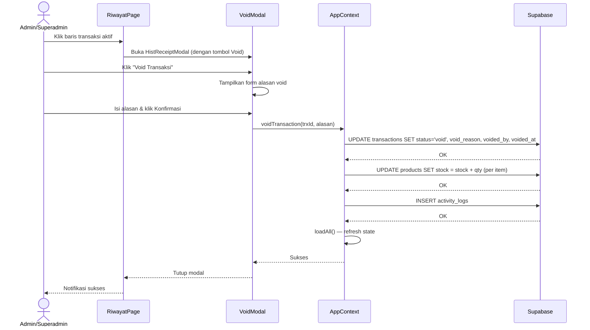

# Design Document: Void/Cancel Transaksi

## Overview

Fitur Void/Cancel Transaksi menambahkan kemampuan pembatalan transaksi pada POS BerkahBirdShop. Ketika sebuah transaksi di-void, statusnya berubah menjadi `'void'`, stok produk dikembalikan secara otomatis, alasan void dicatat, dan jejak audit tersimpan di `activity_logs`. Seluruh data transaksi tetap dipertahankan di database — tidak ada penghapusan record.

Fitur ini diimplementasikan sebagai lapisan tambahan di atas arsitektur yang sudah ada: migrasi database untuk kolom baru, fungsi `voidTransaction` di `AppContext`, modal konfirmasi baru `VoidModal`, dan perubahan tampilan di `RiwayatPage`.

---

## Architecture

### Alur Void Transaksi



### Keputusan Arsitektur

- **Tidak membuat service layer terpisah** — konsisten dengan pola yang sudah ada di AppContext (semua operasi DB ada di sana).
- **Void bukan delete** — record transaksi tetap ada, hanya status yang berubah. Ini menjaga integritas audit.
- **Atomicity via sequential await** — karena Supabase JS client tidak mendukung transaksi multi-tabel secara native di client-side, urutan operasi adalah: (1) update status transaksi, (2) kembalikan stok, (3) catat log. Jika langkah 1 gagal, langkah 2 dan 3 tidak dieksekusi.
- **Pengembalian stok skip NULL product_id** — produk yang sudah dihapus tidak bisa dikembalikan stoknya, tapi void tetap dilanjutkan.

---

## Components and Interfaces

### 1. Database Migration (SQL)

Kolom baru pada tabel `transactions`:

```sql
ALTER TABLE transactions ADD COLUMN IF NOT EXISTS status TEXT NOT NULL DEFAULT 'aktif';
ALTER TABLE transactions ADD COLUMN IF NOT EXISTS void_reason TEXT DEFAULT NULL;
ALTER TABLE transactions ADD COLUMN IF NOT EXISTS voided_by TEXT DEFAULT NULL;
ALTER TABLE transactions ADD COLUMN IF NOT EXISTS voided_at TIMESTAMPTZ DEFAULT NULL;

CREATE INDEX IF NOT EXISTS idx_transactions_status ON transactions(status);
```

### 2. `voidTransaction` di AppContext

Fungsi baru yang ditambahkan ke `AppContext` dan di-expose melalui context value:

```js
// Signature
voidTransaction(trxId: number, alasan: string): Promise<void>
```

**Logika:**
1. Validasi: `currentUser.role` harus `admin` atau `superadmin`
2. Validasi: untuk `admin`, `trx.date` harus sama dengan `TODAY`
3. `UPDATE transactions SET status='void', void_reason=alasan, voided_by=currentUser.nama, voided_at=NOW() WHERE id=trxId`
4. Untuk setiap item di `transaction_items` yang `product_id IS NOT NULL`: `UPDATE products SET stock = stock + qty WHERE id = product_id`
5. `INSERT activity_logs` (jika gagal, log error ke console, lanjutkan)
6. `loadAll()`

### 3. `VoidModal` (komponen baru)

**Path:** `src/components/modals/VoidModal.jsx`

**Props:**
```js
{
  transaction: object | null,  // transaksi yang akan di-void
  currentUser: object,         // untuk cek role dan batas waktu
  onConfirm: (alasan: string) => Promise<void>,
  onClose: () => void,
  loading: boolean,
}
```

**State internal:**
- `alasan: string` — input alasan void
- `error: string` — pesan validasi

**Tampilan:**
- Detail transaksi (kode, tanggal, pelanggan, total, daftar item)
- Field textarea untuk alasan void (wajib)
- Tombol "Konfirmasi Void" (disabled saat loading)
- Tombol "Batal"
- Warning merah: "Tindakan ini tidak dapat dibatalkan. Stok akan dikembalikan."

### 4. Perubahan `HistReceiptModal`

Tambahkan tombol "🚫 Void Transaksi" yang hanya muncul jika:
- `transaction.status !== 'void'`
- `currentUser.role === 'admin' || currentUser.role === 'superadmin'`
- Untuk `admin`: `transaction.date === TODAY`

Jika transaksi sudah void, tampilkan section info void (alasan, voided_by, voided_at).

### 5. Perubahan `RiwayatPage`

**Kolom tabel:** Tambah kolom "Status" dengan badge.

**Badge status:**
- `aktif` → tidak ada badge (atau badge hijau kecil)
- `void` → badge merah "VOID", baris dengan `opacity-50` dan `line-through` pada kode transaksi

**Filter baru:** Dropdown/toggle "Status" dengan opsi: Semua | Aktif | Void

**Kalkulasi total di footer:** Hanya menjumlahkan transaksi dengan `status = 'aktif'`.

### 6. Perubahan `App.jsx`

- Import `VoidModal`
- State baru: `voidTarget: object | null` — transaksi yang sedang akan di-void
- Pass `voidTransaction` dari `useApp()` ke handler
- Render `<VoidModal>` di level `Main`

### 7. Perubahan `AppContext` — kalkulasi dashboard

`todayRev` dan `weekRev` harus mengecualikan transaksi void:

```js
const todayTrx = useMemo(() => transactions.filter(t => t.date === todayStr && t.status !== 'void'), [...]);
const weekTrx = useMemo(() => transactions.filter(t => t.date >= weekStart && t.status !== 'void'), [...]);
```

---

## Data Models

### Tabel `transactions` (setelah migrasi)

| Kolom | Tipe | Default | Keterangan |
|---|---|---|---|
| `id` | BIGSERIAL | — | Primary key |
| `trx_code` | TEXT | — | Kode unik transaksi |
| `date` | DATE | CURRENT_DATE | Tanggal transaksi |
| `customer` | TEXT | 'Umum' | Nama pelanggan |
| `total` | INTEGER | 0 | Total transaksi |
| `payment` | INTEGER | 0 | Nominal pembayaran |
| `change_amt` | INTEGER | 0 | Kembalian |
| `status` | TEXT | **'aktif'** | `'aktif'` atau `'void'` |
| `void_reason` | TEXT | NULL | Alasan void |
| `voided_by` | TEXT | NULL | Nama user yang void |
| `voided_at` | TIMESTAMPTZ | NULL | Waktu void |
| `created_at` | TIMESTAMPTZ | NOW() | Waktu dibuat |

### Aturan Akses Void

| Role | Bisa Void? | Batasan Tanggal |
|---|---|---|
| `superadmin` | ✅ Ya | Tidak ada |
| `admin` | ✅ Ya | Hanya transaksi hari ini (H+0) |
| `pegawai` | ❌ Tidak | — |

### Fungsi Helper: `canVoid(currentUser, transaction)`

```js
// src/utils/constants.js (tambahan)
export function canVoid(currentUser, transaction) {
  if (!currentUser) return false;
  if (transaction.status === 'void') return false;
  if (currentUser.role === 'superadmin') return true;
  if (currentUser.role === 'admin') return transaction.date === TODAY;
  return false; // pegawai
}
```

---

## Correctness Properties

*A property is a characteristic or behavior that should hold true across all valid executions of a system — essentially, a formal statement about what the system should do. Properties serve as the bridge between human-readable specifications and machine-verifiable correctness guarantees.*

### Property 1: Superadmin selalu bisa void transaksi aktif

*For any* transaksi dengan `status = 'aktif'` dan tanggal apa pun, fungsi `canVoid` dengan user berole `superadmin` SHALL selalu mengembalikan `true`.

**Validates: Requirements 1.1, 2.4**

---

### Property 2: Admin hanya bisa void transaksi hari ini

*For any* transaksi dengan `status = 'aktif'`, fungsi `canVoid` dengan user berole `admin` SHALL mengembalikan `true` jika dan hanya jika `transaction.date === TODAY`.

**Validates: Requirements 1.2, 2.3, 2.5**

---

### Property 3: Pegawai tidak pernah bisa void

*For any* transaksi dengan status apa pun dan tanggal apa pun, fungsi `canVoid` dengan user berole `pegawai` SHALL selalu mengembalikan `false`.

**Validates: Requirements 1.3**

---

### Property 4: Transaksi void tidak bisa di-void ulang

*For any* transaksi dengan `status = 'void'`, fungsi `canVoid` SHALL selalu mengembalikan `false` untuk role apa pun (termasuk superadmin).

**Validates: Requirements 2.1, 2.2**

---

### Property 5: Validasi alasan void menolak input kosong/whitespace

*For any* string yang terdiri seluruhnya dari whitespace (termasuk string kosong), fungsi validasi alasan void SHALL mengembalikan `false` / pesan error.

**Validates: Requirements 3.3**

---

### Property 6: Setelah void, semua field void tersimpan dengan benar

*For any* transaksi aktif yang di-void oleh user mana pun dengan alasan yang valid, record transaksi di database SHALL memiliki `status = 'void'`, `void_reason` sama dengan alasan yang diberikan, `voided_by` sama dengan nama user, dan `voided_at` berisi timestamp yang valid.

**Validates: Requirements 4.1, 4.2, 4.3, 4.4**

---

### Property 7: Stok dikembalikan sesuai qty setelah void

*For any* transaksi aktif dengan satu atau lebih item (dengan `product_id` tidak null), setelah void berhasil, stok setiap produk yang terlibat SHALL bertambah tepat sebesar `qty` item tersebut dalam transaksi.

**Validates: Requirements 5.1, 5.2**

---

### Property 8: Total pendapatan mengecualikan transaksi void

*For any* kumpulan transaksi yang berisi campuran transaksi aktif dan void, kalkulasi total pendapatan SHALL sama dengan jumlah `total` dari transaksi dengan `status = 'aktif'` saja.

**Validates: Requirements 7.5**

---

### Property 9: Render badge VOID untuk semua transaksi void

*For any* transaksi dengan `status = 'void'`, fungsi render baris tabel di `RiwayatPage` SHALL menghasilkan output yang mengandung teks/elemen "VOID".

**Validates: Requirements 7.1**

---

## Error Handling

| Skenario | Penanganan |
|---|---|
| User `pegawai` mencoba void | Tolak di level `canVoid`, tampilkan error "Anda tidak memiliki izin untuk membatalkan transaksi." |
| `admin` void transaksi bukan hari ini | Tolak di level `canVoid`, tampilkan error "Hanya transaksi hari ini yang dapat dibatalkan oleh Admin." |
| Alasan void kosong/whitespace | Validasi di `VoidModal` sebelum submit, tampilkan "Alasan void wajib diisi." |
| Gagal UPDATE `transactions` di DB | Tampilkan error "Gagal membatalkan transaksi. Silakan coba lagi.", hentikan proses (stok tidak diubah) |
| Gagal UPDATE `products` (stok) | Tampilkan error, idealnya rollback status transaksi (set kembali ke 'aktif') |
| `product_id` NULL pada item | Skip pengembalian stok untuk item tersebut, lanjutkan void |
| Gagal INSERT `activity_logs` | Log error ke console, lanjutkan — void tetap dianggap sukses |
| Double-submit (klik dua kali) | Tombol konfirmasi disabled selama `loading = true` |

---

## Testing Strategy

### Unit Tests (Vitest)

Fokus pada fungsi pure dan logika bisnis yang bisa diisolasi:

- `canVoid(user, transaction)` — semua kombinasi role dan status
- `validateVoidReason(input)` — string kosong, whitespace, valid
- Kalkulasi total pendapatan yang mengecualikan void
- Render badge VOID di baris tabel

### Property-Based Tests (fast-check)

Library: **fast-check** (sudah tersedia di ekosistem Vite/Vitest)

Konfigurasi: minimum **100 iterasi** per property test.

Setiap property test diberi tag komentar:
```
// Feature: void-cancel-transaksi, Property N: <deskripsi singkat>
```

**Property 1** — `canVoid` superadmin selalu true untuk transaksi aktif:
```js
// Feature: void-cancel-transaksi, Property 1: superadmin selalu bisa void transaksi aktif
fc.assert(fc.property(
  fc.record({ date: fc.string(), status: fc.constant('aktif') }),
  (trx) => canVoid({ role: 'superadmin' }, trx) === true
), { numRuns: 100 });
```

**Property 2** — `canVoid` admin hanya true untuk transaksi hari ini:
```js
// Feature: void-cancel-transaksi, Property 2: admin hanya bisa void transaksi hari ini
fc.assert(fc.property(
  fc.record({ date: fc.oneof(fc.constant(TODAY), fc.string()), status: fc.constant('aktif') }),
  (trx) => canVoid({ role: 'admin' }, trx) === (trx.date === TODAY)
), { numRuns: 100 });
```

**Property 3** — `canVoid` pegawai selalu false:
```js
// Feature: void-cancel-transaksi, Property 3: pegawai tidak pernah bisa void
fc.assert(fc.property(
  fc.record({ date: fc.string(), status: fc.oneof(fc.constant('aktif'), fc.constant('void')) }),
  (trx) => canVoid({ role: 'pegawai' }, trx) === false
), { numRuns: 100 });
```

**Property 4** — transaksi void tidak bisa di-void ulang:
```js
// Feature: void-cancel-transaksi, Property 4: transaksi void tidak bisa di-void ulang
fc.assert(fc.property(
  fc.record({ date: fc.string(), status: fc.constant('void') }),
  fc.oneof(fc.constant('superadmin'), fc.constant('admin'), fc.constant('pegawai')),
  (trx, role) => canVoid({ role }, trx) === false
), { numRuns: 100 });
```

**Property 5** — validasi alasan menolak whitespace:
```js
// Feature: void-cancel-transaksi, Property 5: validasi alasan menolak input kosong/whitespace
fc.assert(fc.property(
  fc.stringOf(fc.constantFrom(' ', '\t', '\n', '\r')),
  (input) => validateVoidReason(input) === false
), { numRuns: 100 });
```

**Property 8** — total pendapatan mengecualikan void:
```js
// Feature: void-cancel-transaksi, Property 8: total pendapatan mengecualikan transaksi void
fc.assert(fc.property(
  fc.array(fc.record({
    total: fc.integer({ min: 0, max: 10_000_000 }),
    status: fc.oneof(fc.constant('aktif'), fc.constant('void')),
  })),
  (transactions) => {
    const result = calcRevenue(transactions);
    const expected = transactions.filter(t => t.status === 'aktif').reduce((s, t) => s + t.total, 0);
    return result === expected;
  }
), { numRuns: 100 });
```

### Integration Tests

- Void transaksi end-to-end dengan Supabase (1-2 contoh): verifikasi semua kolom tersimpan dan stok bertambah
- Verifikasi transaksi void tidak muncul di total laporan

### Snapshot / Example Tests

- Modal `VoidModal` render dengan data transaksi yang benar
- Badge VOID muncul di baris tabel
- Tombol void tidak muncul untuk role `pegawai`
- Tombol void tidak muncul untuk transaksi yang sudah void
