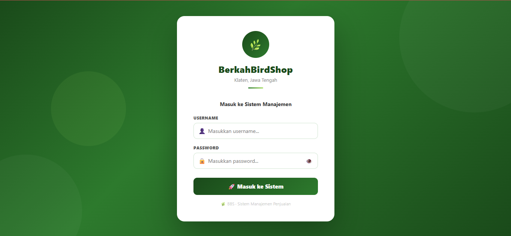
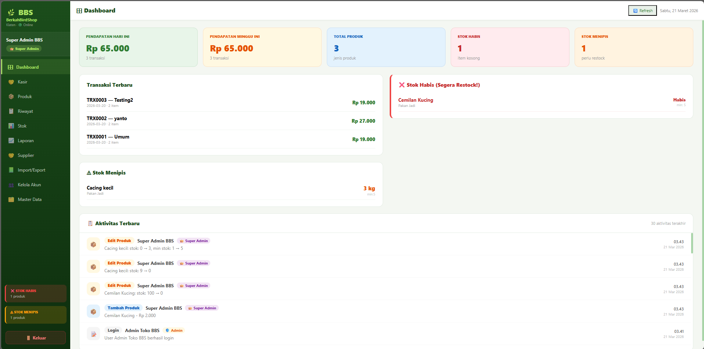
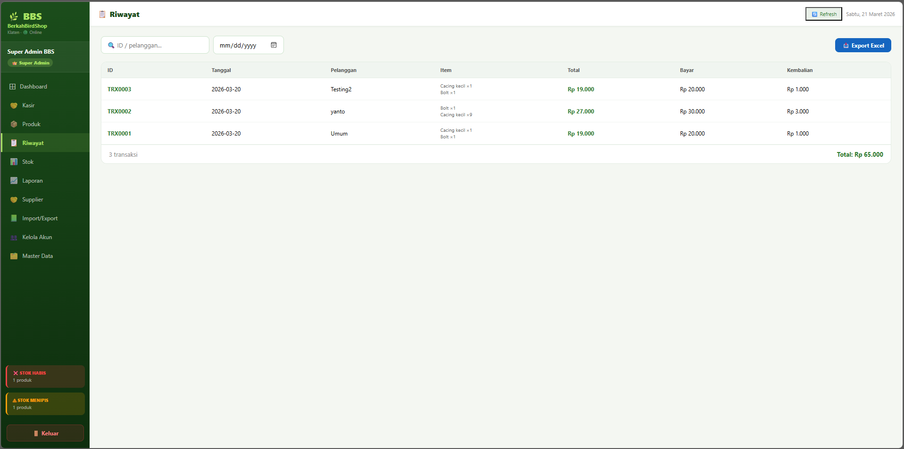
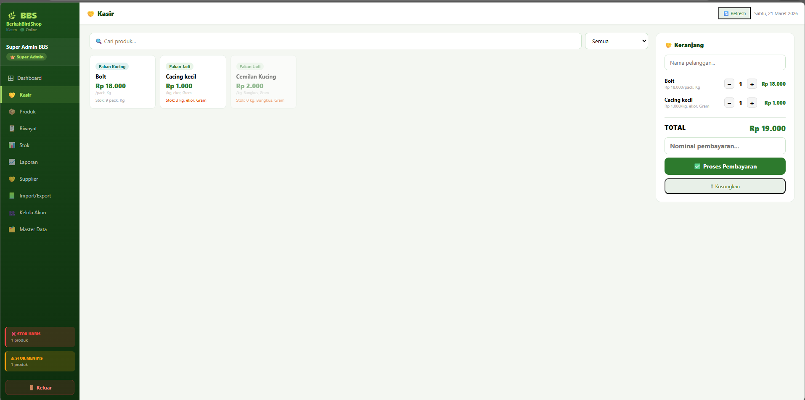
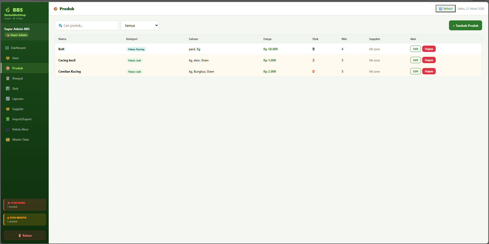
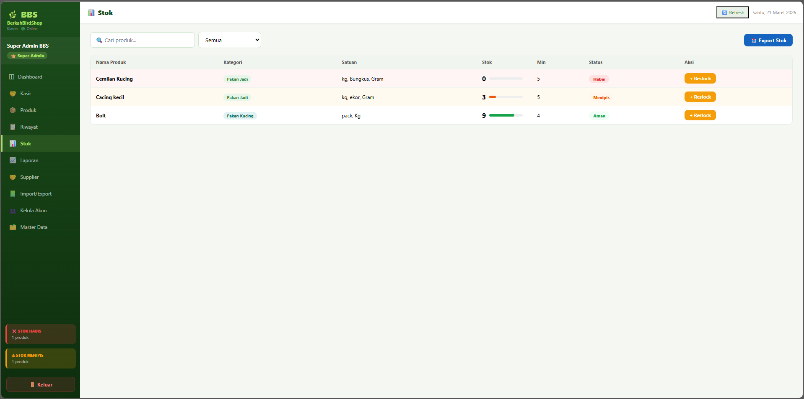
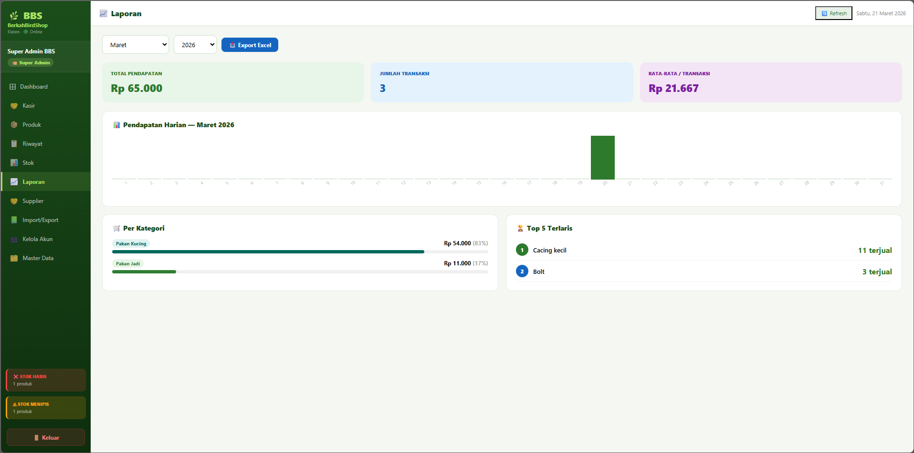
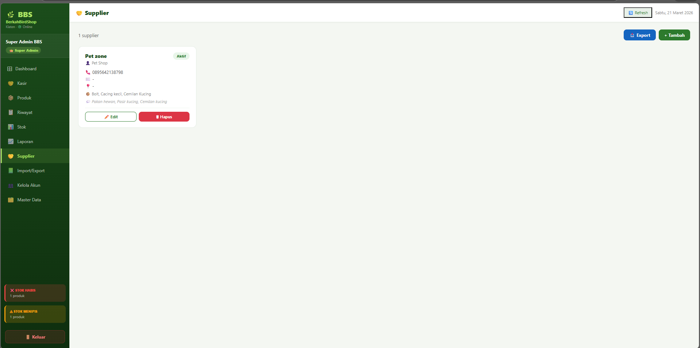
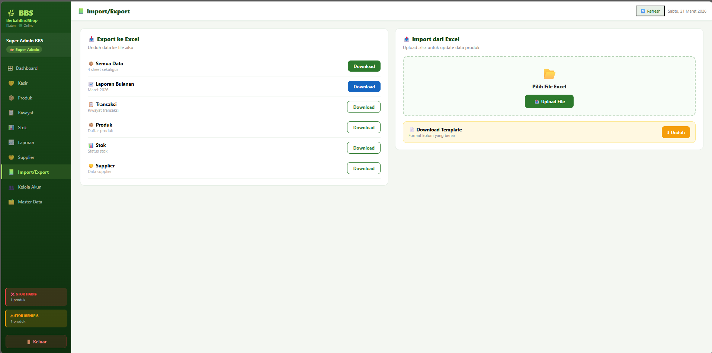

# 🛒 Sistem Kasir & Manajemen Stok - Berkah Bird Shop (Toko BBS)

Aplikasi web Sistem Kasir (*Point of Sale*) dan Manajemen Inventaris interaktif yang dirancang khusus untuk **Berkah Bird Shop**. Sistem ini mempermudah pemilik toko dalam mempercepat transaksi kasir, mengontrol ketersediaan stok, mengelola daftar barang, serta melacak riwayat operasional harian secara presisi.

## ✨ Fitur Utama
- **Dashboard Analitik:** Ringkasan pendapatan, info total produk, dan pemantauan otomatis (*Real-time*) untuk peringatan **Stok Habis** maupun **Stok Menipis**.
- **Kasir (POS):** Antarmuka transaksi kasir kilat dengan fitur pencarian cerdas, kalkulator kembalian otomatis, dan struk digital.
- **Manajemen Inventaris:** Pusat kontrol untuk menambah, mengedit, dan menghapus detail produk beserta harga jual dan beli.
- **Master Data:** Pencatatan rapi untuk *Supplier*, *Kategori*, *Satuan Produk*, dan *Manajemen Pengguna (Akun Kasir/Admin)*.
- **Auto-Purge Aktvitas:** Log aktivitas pengguna pintar yang otomatis menghapus riwayat log lebih tua dari 31 hari tanpa memperlambat aplikasi.

---

## 📸 Galeri & Penjelasan Fitur Lengkap

Berikut adalah peragaan visual fungsi aplikasi secara mendalam dari keseluruhan 13 tangkapan layar fitur Toko BBS:

### 1. Keamanan Akses
- **Halaman Login Utama**
  Antarmuka otentikasi PIN multi-level yang aman dan intuitif, melindungi akses masuk untuk Administrator dan Kasir reguler.
  
  
- **Manajemen Akun dan Role Akses (Role Features)**
  Panel kendali untuk mengelola hak otorisasi tiap-tiap pegawai secara spesifik demi mencegah penyalahgunaan fitur sistem operasi.
  
  

### 2. Monitoring Performa Bisnis
- **Dashboard Toko (Intelijensi Ringkasan)**
  Menampilkan kalkulasi seketika pendapatan hari ini/mingguan, peringatan daftar stok tipis, stok habis, serta cuplikan laju kecepatan transaksi yang sedang berlangsung.
  

- **Rekam Jejak Log Harian (Aktvitas Terbaru)**
  Audit otomatis (tidak bisa dimanipulasi) yang mencatat *siapa melakukan apa* pada *jam berapa*, memfasilitasi audit inventori yang akuntabel.
  

### 3. Jantung Operasional (Kasir & Stok)
- **Mesin Kasir Cepat (Point Of Sale)**
  Keranjang belanja digital pintar. Fitur pencarian barang sekali klik, fitur kembalian persis, serta integrasi tombol nota tercetak untuk pelanggan.
  

- **Buku Induk Manajemen Produk**
  Portal untuk mengatur identitas produk (harga modal, harga jual, barcode stok, margin keuntungan) dalam ekosistem database terpusat.
  

- **Modul Pengawasan Stok (Audit Kuantitas)**
  Formulir manajemen stok tunggal tempat mengeksekusi proses masuknya restock produk tanpa harus mengganggu tabel finansial inti penjualan.
  

### 4. Pembukuan, Rekanan & Backups
- **Rekapitulasi Laporan Transaksi**
  Lembaran transaksi penjualan rapi dengan kalkulasi total item yang transparan, mudah dilacak, dan berguna untuk menghitung tutup kas kasir.
  

- **Database Kontak Supplier Bisnis**
  Tempat penyimpanan rincian nomor dan alamat distributor pasokan burung / pakan, mempercepat re-order stok massal.
  

- **Utilitas Import & Export Data**
  Fitur cadangan (backup) tangguh. Anda bisa menarik laporan database *offline* ke Excel/CSV sebagai perlindungan data ganda.
  

### 5. Pengkategorian Tingkat Lanjut (Master Data)
Sistem relasi parameter untuk menjaga konsistensi pendaftaran produk baru di masa depan:
- **Pengelompokan Jenis (Kategori Produk)**
  
- **Satuan Pengukuran Fisik (Gram, Kg, Pack, Ekor)**
  

---

## 🛠️ Teknologi Pembuatan
- **Frontend:** React.js + Vite (Cepat & Ringan)
- **Desain:** CSS Modular Murni
- **Backend/Database:** Supabase (Cloud PostgreSQL)

## 👨‍💻 Dibuat Oleh
Sistem ini diprogram secara mandiri dan dikembangkan oleh:
**Naha Nidz**

---
## 🚀 Cara Menjalankan Proyek Secara Lokal

Pastikan Anda sudah memiliki [Node.js](https://nodejs.org/) yang terinstal di komputer.
Jalankan perintah berikut di *Terminal* (*Command Prompt*):

1. **Instal seluruh modul (*dependencies*):**
   ```bash
   npm install
   ```
2. **Jalankan server pengembangan lokal:**
   ```bash
   npm run dev
   ```
3. Buka link yang muncul di terminal (contoh: `http://localhost:5173`) menggunakan *browser* Anda!
